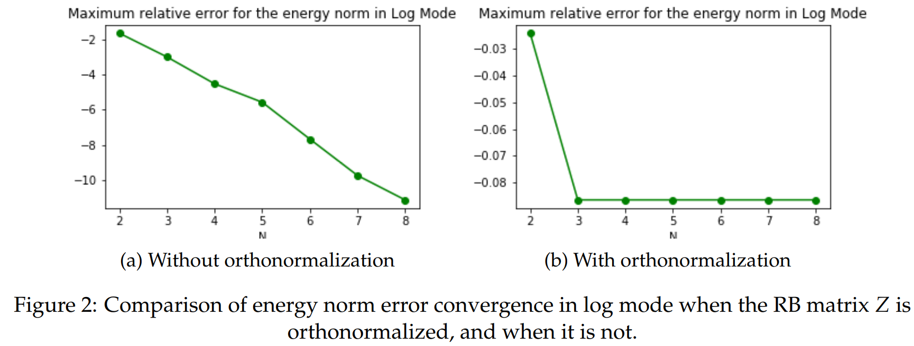

# Reduced Basis Method
Reduced Basis Method applied to thermal fin FEM problems. 

## Screenshots
Each folder contains a problem to solve.
- ### Problem Set 1: RB for Linear Affine Elliptic Problems (from a theoretical standpoint)

- ### Problem Set 2: RB for Linear Affine Elliptic Problems (from a numerical standpoint)

- ### Problem Set 3: A Posteriori Error Bounds, Greedy Sampling Procedure

- ### Problem Set 4: Parabolic Problems

## Ressources
- [Website on reduced basis methods](http://augustine.mit.edu/index.htm)
- [Master CSMI](https://docs.google.com/document/d/10JbbXeqqu5J2BjMkSQRNQ8Gx7xBPOClLKpvd7EBZT8U/edit#)